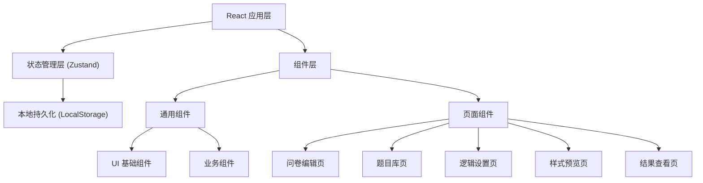
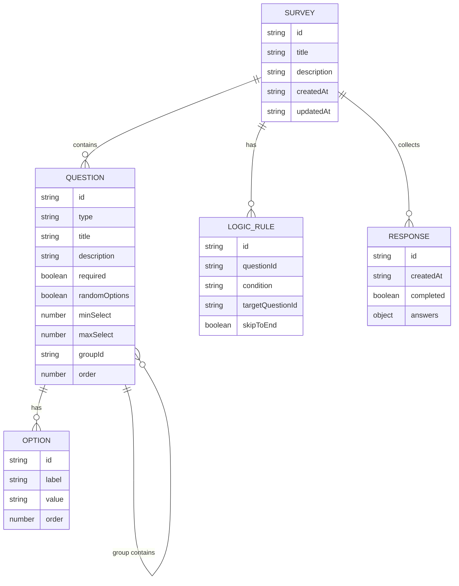

## 1. 架构设计



纯前端单页应用架构，采用 React 组件化开发，Zustand 管理全局状态，LocalStorage 持久化数据。

## 2. 技术描述

- **前端框架**：React@18 + TypeScript
- **构建工具**：Vite@5
- **样式方案**：Tailwind CSS@3
- **状态管理**：Zustand@4
- **路由管理**：React Router DOM@6
- **图标库**：Lucide React
- **拖拽库**：@dnd-kit/core + @dnd-kit/sortable
- **图表库**：Recharts@2
- **Excel 导出**：xlsx
- **UUID 生成**：uuid

## 3. 路由定义

| 路由 | 用途 |
|-------|---------|
| `/` | 问卷编辑页 - 题目列表和编辑 |
| `/library` | 题目库页 - 题目模板管理 |
| `/logic` | 逻辑设置页 - 跳题规则配置 |
| `/preview` | 样式预览页 - 手机/电脑视图预览 |
| `/results` | 结果查看页 - 统计分析和导出 |

## 4. 数据模型

### 4.1 核心数据结构



### 4.2 TypeScript 类型定义

```typescript
type QuestionType = 'single' | 'multiple' | 'text' | 'rating' | 'ranking' | 'group';

interface Option {
  id: string;
  label: string;
  value: string;
  order: number;
}

interface Question {
  id: string;
  type: QuestionType;
  title: string;
  description?: string;
  required: boolean;
  randomOptions: boolean;
  minSelect?: number;
  maxSelect?: number;
  groupId?: string;
  order: number;
  options?: Option[];
  questions?: Question[];
}

interface LogicRule {
  id: string;
  questionId: string;
  conditionType: 'equals' | 'notEquals' | 'contains' | 'greaterThan' | 'lessThan';
  conditionValue: string;
  targetQuestionId?: string;
  skipToEnd: boolean;
}

interface Response {
  id: string;
  createdAt: string;
  completed: boolean;
  answers: Record<string, string | string[] | number>;
}

interface Survey {
  id: string;
  title: string;
  description?: string;
  createdAt: string;
  updatedAt: string;
  questions: Question[];
  logicRules: LogicRule[];
  responses: Response[];
}
```

### 4.3 状态管理 Store

使用 Zustand 创建全局 Store，包含以下核心方法：

```typescript
interface SurveyStore {
  survey: Survey;
  selectedQuestionId: string | null;
  
  // 问卷操作
  updateSurveyTitle: (title: string) => void;
  updateSurveyDescription: (description: string) => void;
  
  // 题目操作
  addQuestion: (type: QuestionType, afterId?: string) => void;
  duplicateQuestion: (id: string) => void;
  deleteQuestion: (id: string) => void;
  updateQuestion: (id: string, updates: Partial<Question>) => void;
  reorderQuestions: (items: Question[]) => void;
  moveQuestionToGroup: (questionId: string, groupId: string) => void;
  
  // 选项操作
  addOption: (questionId: string) => void;
  updateOption: (questionId: string, optionId: string, label: string) => void;
  deleteOption: (questionId: string, optionId: string) => void;
  batchUpdateOptions: (questionId: string, labels: string[]) => void;
  
  // 逻辑规则
  addLogicRule: (rule: Omit<LogicRule, 'id'>) => void;
  updateLogicRule: (id: string, updates: Partial<LogicRule>) => void;
  deleteLogicRule: (id: string) => void;
  
  // 模拟数据
  generateMockResponses: (count: number) => void;
  
  // 持久化
  loadFromStorage: () => void;
  saveToStorage: () => void;
}
```

## 5. 项目结构

```
src/
├── components/
│   ├── common/          # 通用组件
│   │   ├── Button.tsx
│   │   ├── Card.tsx
│   │   ├── Input.tsx
│   │   ├── Modal.tsx
│   │   └── Tabs.tsx
│   ├── survey/          # 问卷相关组件
│   │   ├── QuestionEditor.tsx
│   │   ├── QuestionCard.tsx
│   │   ├── OptionEditor.tsx
│   │   ├── QuestionTypeSelector.tsx
│   │   ├── DraggableQuestion.tsx
│   │   └── PreviewRenderer.tsx
│   ├── results/         # 结果展示组件
│   │   ├── StatCard.tsx
│   │   ├── SingleChart.tsx
│   │   ├── MultipleChart.tsx
│   │   └── TextAnswers.tsx
│   └── layout/          # 布局组件
│       ├── Sidebar.tsx
│       └── Header.tsx
├── pages/
│   ├── EditorPage.tsx
│   ├── LibraryPage.tsx
│   ├── LogicPage.tsx
│   ├── PreviewPage.tsx
│   └── ResultsPage.tsx
├── store/
│   └── useSurveyStore.ts
├── types/
│   └── survey.ts
├── utils/
│   ├── export.ts
│   ├── mockData.ts
│   └── logic.ts
├── data/
│   └── questionLibrary.ts
├── App.tsx
├── main.tsx
└── index.css
```
